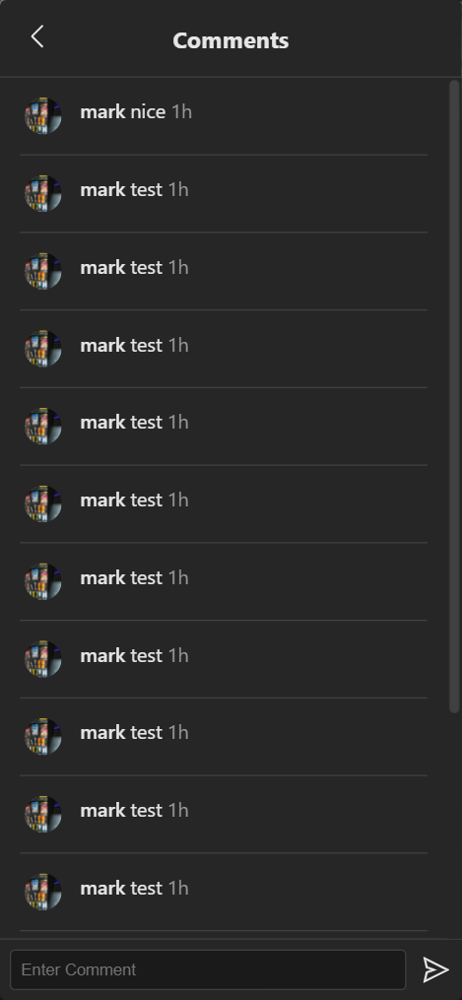
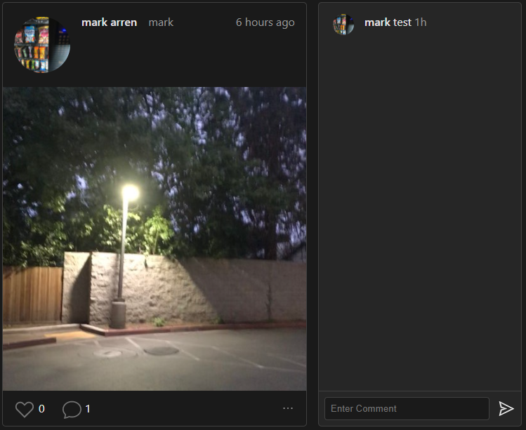

# **Components**
<!--  Show components in different states for different screens -->
# Navbar
This component is used for navigation around the whole website and is used on almost every page. This component also displays a user’s notifications.

    
    

Navbar open on mobile, notifications open on mobile

## States
* notificationsOpen - Tracks whether notifications menu is open
* notifications - Stores all users notifications

## Functions
### useEffect
Fetches all the users [notifications](./Firestore.md#Notifications) from the database and updates the `notifications` state when `notificationsOpen` is set to true

## Sub-components
* Notification

---
# Post
This component is used to display a post and comments for that post.

    
    

Comments open on mobile, comments open on desktop

## Props
This component takes in one prop which is an object [post](./Firestore.md#post)

## States
* showComments - Toggles the view of the comments
* hasLiked - Shows whether the user has liked the post
* moreOpen - Toggles the view of the more window popup
* likeCount - Tracks like count
* commentCount - Tracks comment count

<!-- ## Styling uses
*  -->

## Sub-components
* Comment
<!-- * VscHeart
* AiOutlineSend
* AiOutlineEllipsis -->

## Functions
### viewComments
This function fetches the comments from the database and then toggles the view of the comments

### handleSubmitComment
This function is used to post a comment on a post and also sends a notification

### handleSubmitLike
This function is used to like a post and also sends a notification

### handleDeletePost
This is called when a user presses the delete button on a post and will the delete the post from users [posts](./Firestore.md#Posts) subcollection, where the [cloud function](./CloudFunctions.md#fanOutStory) will handle the deletion from other users feed.

<!-- TODO show post in different states & mobile-->

---
# Notification
This component displays a single notification.

3 different types of notifications

## States
* doesFollow - Whether the user follows or not

## Functions
### handleFollow
Handles when the follow button is pressed, calling [followUser](./HelperFunctions.md#followUser) and then sets `doesFollow`

---
# UploadForm
This component is the form to upload a post or a story. See [Upload Page](./Pages.md#Upload) for images

## States
* image - Stores image uploaded by user
* caption - Stores the caption of the post
* errors - Stores any errors

## Functions
### handleSubmit
Handles uploading the post. First check if user is logged in and there is an image. Then calls [uploadPost](./HelperFunctions.md#uploadPost).
### handleStorySubmit
Handles uploading the story. First check if user is logged in and there is an image. Then calls [uploadStory](./HelperFunctions.md#uploadStory).

---
# Stories
This component is used to view individual stories and also shows the preview of multiple stories. See [Feed Page](./Pages.md#Feed) for images

## Props
This component takes in one prop which is the object `stories` which is a collection of all stories that need to be displayed

## States
* showStory - Toggles the view of an individual story
* currentStoryIndex - The index of the current individual story being viewed

## Functions
### handleStoryClick
Used to toggle the individual view of a story by setting the `currentStoryIndex` and `showStory`.

### handlePreviousStory
Used to go back one story, decrements the `currentStoryIndex`. If the index goes below zero, then the individual story view is closed.

### handleNextStory
Used to go forward one story, increments the `currentStoryIndex`. If the index reaches the end, then the individual story view is closed.

---
### [Chapter 6 Helper Functions](./HelperFunctions.md)