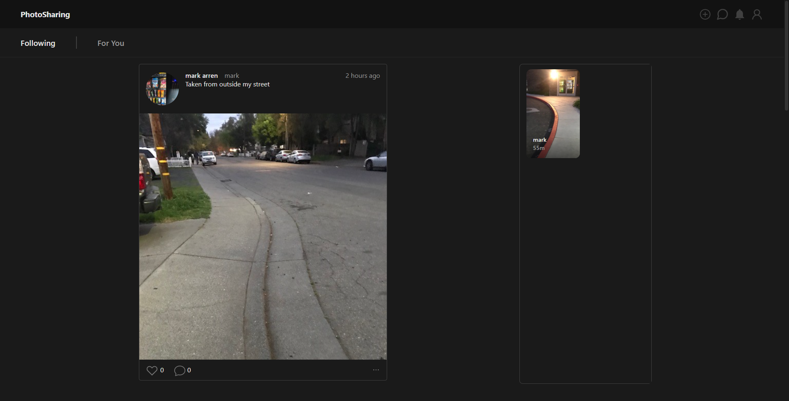

# **Pages**
<!-- TODO add pictures for all pages -->
# Login/ Signup
This is the first page a guest user will see when they get to the site, and will allow them to sign up, login, login with google and reset their password.

When signing up the sites asks them for their email, name, username and password.

    
    
    

## States
* error - Used to store error messages
* loading - Boolean which stores if the page is loading

---
# Feed
The feed page is the first page the user sees after they are logged in and is where most of the user will spend their time on the site. 

The main feature of the feed page is to show posts and stories from all the users that the user follows.
It also features a 'For You' page which shows posts from other users which they might not follow

    
    

## Components
The main components which make up the page are:
* [Post](./Components.md#Post)
* [Stories](./Components.md#Stories)

---
# Messages
The messages page is where the user can view all their messages.

    
    

## States
* messagesList - Stores list of conversations
* selectedMessage - Stores selected conversation UID
* showCompose - Boolean to toggle compose conversation menu
* composeContacts - List to stores contacts for compose conversation menu
* inMessage - Sets if currently inside message, used only for mobile

## Functions
### getUserFromCovo
Takes a conversation as a parameter and returns the correct user in a conversation as it also stores the current user.
### composeConversation
Takes a user as a parameter and composes a converastion with that user. Checks if user is already in `messageList` if they are then move them to the top if not then add them to it. Then sets this converastion in `selectedMessage` and sets `inMessage`.
### changeSelectedMessage
Takes a conversation as a paramters and sets `setSelectedMessage` and `inMessage`
### useEffect
Used to fetch all the user's conversations and set `messagesList`
### useEffect
Used to get all users for the `composeContacts` list when `showCompose` is set to true

---
# Profile
The profile page is used to view any user's profile.

    
    

## Props
* username - The username of the profile to view

## States
* posts - Stores all users posts
* currentPost - Stores current post selected
* showPost - Toggles viewing the currentPost
* user - Stores all user data for the current profile
* userExists - Stores if the user exists
* doesFollow - Stores whether the user follows them or not

## Functions
### handleFollow
Function which is called when the follow button is pressed. The function first checks if the user is not on their own profile, then calls [followerUser](./HelperFunctions.md#followUser) and depending on the result sets `doesFollow` and also updates the user's follower count
### useEffect
This is used to get all information on the user.

It first searches the [user collection](./Firestore.md#User) for the `username` if it is not found `userExists` is set to false. If it is found then it sets `user`, fetches all their posts and sets `posts`, and then checks if the user follows them.

<!-- TODO maybe talk about if user is not found what it displays -->

---
# Upload
The upload page is where the user uploads their [posts](./Firestore.md#Posts) and [stories](./Firestore.md#Stories). The main component is the UploadForm.

    
    

## Components
* [UploadForm](./Components#UploadForm)

---
### [Chapter 5 Components](./Components.md)